# AVR-2: Анализ временных рядов. Итоговое задание

**Студент:** Щетников Даниил, группа BHEMAI-25-AVR-2
**Репозиторий:** https://github.com/Shchetnikovoff/AVR2-TimeSeries
**Ноутбук:** `AVR2_Time_Series_Analysis.ipynb` (выполнен end-to-end, 30 ячеек, ноль ошибок)
**Дополнительный скрипт верификации:** `report_figures.py` (пересобирает все модели и графики отчета, воспроизводит метрики до 1e-9)
**Пайплайн:** `pipeline.py` (прогноз end-to-end за 2.5 c)

Версия отчета 3 (доработка по замечаниям от 14.09: встроены все графики, добавлены полный дамп параметров, прогнозы всех 14 моделей на holdout, бектест по окнам и тест Диболда-Мариано).

---

## 1. Описание временного ряда

Суточный минимум температуры воздуха, Мельбурн (Австралия), 01.01.1981 - 31.12.1990. Источник: метеослужба Австралии BOM, файл `daily-min-temperatures.csv` из открытого набора Jason Brownlee (https://github.com/jbrownlee/Datasets). Исходный файл лежит в `data/daily-min-temperatures.csv`, подготовленный ряд в `data/melbourne_tmin_daily_processed.csv`.

Характеристики ряда: 3652 календарных дня, среднее 11.18 C, стандартное отклонение 4.07 C, минимум 0.0 C, максимум 26.3 C. Ряд с сильной годовой сезонностью (январь около 15.0 C, июль около 6.7 C) и слабой недельной динамикой. Практический смысл прогноза: нагрузка на отопление и охлаждение в энергетике, риск заморозков в сельском хозяйстве.

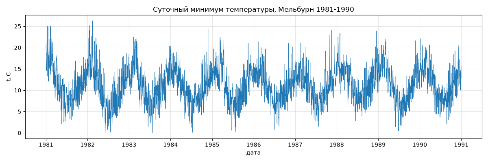

## 2. Постановка задачи

Прогноз на h = 90 дней вперед по дневным данным. Разбиение фиксированное и открыто в коде: train, первые 3562 дня (1981 - 02.10.1990), holdout, последние 90 дней (03.10.1990 - 31.12.1990). Метрики на holdout: RMSE, MAE, MAPE (значения по модулю меньше 0.5 C исключены из знаменателя, зимой температуры близки к нулю), sMAPE. Надежность оценивается четырьмя способами: rolling-бектест на 3 окнах по 90 дней со сдвигом 90, покрытие прогнозных интервалов 80/95, анализ остатков (ACF + Ljung-Box), тест Диболда-Мариано на значимость различий между моделями.

## 3. EDA

Пропуски: в исходном файле нет 2 календарных дат (1984 и 1988 годы), ряд достроен до полного дневного диапазона, пропуски заполнены линейной интерполяцией. Дубликатов дат нет, шаг после предобработки строго суточный.

Стационарность: расширенный тест Дики-Фуллера на уровнях, статистика -4.44, p-value 0.00025, ряд стационарен в уровнях, порядок интегрирования d = 0 (обосновывает ARIMA без разностей).

Сезонность: ACF(365) = 0.48, ACF(180) = -0.48 (полугодовой противофазный пик), месячные средние подтверждают годовой цикл. Аддитивная декомпозиция с периодом 365: на сезонную компоненту приходится 0.81 дисперсии, на тренд 0.01, на остаток 0.18. PACF: лаг 1 доминирует (0.77), значимые лаги до 7 включительно (обосновывает ручной AR(7)).

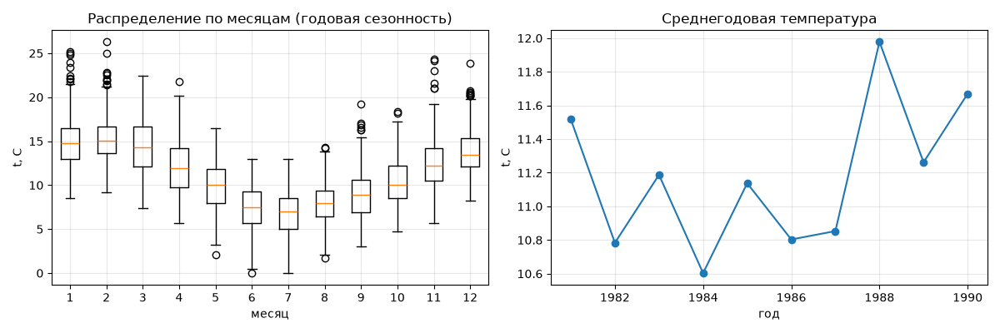

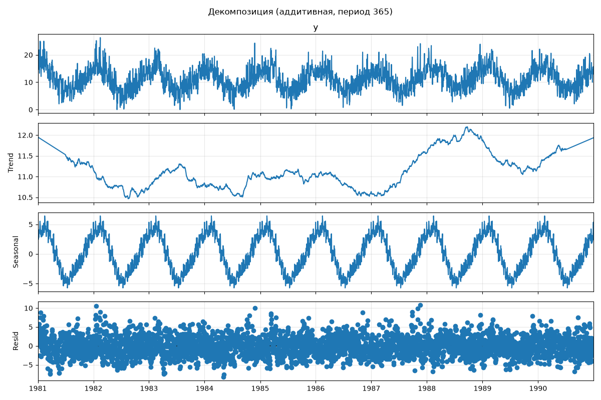

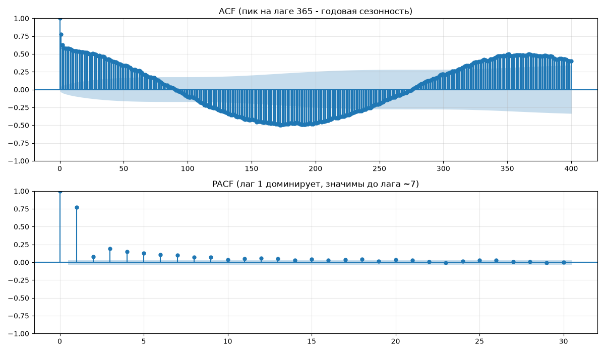

**Вывод по EDA:** ряд регулярный, годовая сезонность главная сила, тренд почти отсутствует, стационарность в уровнях позволяет использовать ARIMA без разностей, а PACF задает порядок AR(7). Сезонность длиной 365 дней означает, что модели должны работать с длинным сезонным лагом, это ограничивает выбор: классический SARIMA с m=365 не практичен, поэтому в работе сезонные статметоды взяты из statsforecast (HoltWinters, Theta, ETS), где длинная сезонность поддерживается напрямую.

## 4. Методы и обоснование параметров

Всего 14 конфигураций: 2 бейзлайна, 6 статистических (3 метода в ручном и авто режимах), 3 ML, 3 DL. Полный дамп параметров, seed и версий: `results/model_configs.json`. Seed 42 зафиксирован везде: numpy, torch и random_state моделей.

| Группа | Модель | Ключевые параметры | Обоснование |
|---|---|---|---|
| бейзлайн | Naive | последнее значение | точка отсчета |
| бейзлайн | SeasonalNaive(365) | сезонный лаг 365 | лаг обоснован ACF(365)=0.48 |
| стат, ручной | ARIMA(7,0,0) | p=7, d=0, q=0 | d=0 по ADF (p=0.00025), AR(7) по PACF |
| стат, авто | AutoARIMA(m=7) | автоподбор, сезонность 7 | проверка, найдет ли авто режим больше ручного |
| стат, ручной | HoltWinters | m=365, аддитивные компоненты | годовая сезонность, главный кандидат по EDA |
| стат, авто | AutoETS(m=365) | model="ZZZ", автовыбор структуры | проверка автовбора на длинной сезонности |
| стат, ручной | Theta(m=365) | классический Theta | сезонный ряд с доминирующей периодикой |
| стат, авто | AutoTheta(m=365) | автоподбор сглаживания | сравнение с ручным |
| ML | RandomForest | 200 деревьев, seed 42 | бэггинг на лаговых признаках |
| ML | HistGradientBoosting | default, seed 42 | бустинг на тех же признаках |
| ML | Ridge | alpha=1.0 | линейная регрессия как контроль |
| DL | LSTM | input 365, max_steps 500, seed 42 | полный годовой контекст в рекуррентной сети |
| DL | MLP | input 365, max_steps 500, seed 42 | полносвязная сеть на годовом окне |
| DL | NHITS | input 365, max_steps 500, seed 42 | иерархическая архитектура |

Признаки для ML (mlforecast): лаги 1-7, 14, 21, 28, 35, 90, 180, 364, 365 плюс календарные признаки dayofweek, month, quarter, dayofyear. Набор лагов составлен из EDA: короткие лаги по PACF, годовые по ACF.

## 5. Результаты на holdout (90 дней)

Числа из `results/metrics_holdout.csv`, вывод кода ноутбука. Главный критерий сравнения RMSE в градусах: MAPE на этом ряде завышается малыми зимними знаменателями (температуры 5-8 C).

| Метод | Режим | RMSE | MAE | MAPE, % | sMAPE, % | Комментарий |
|---|---|---|---|---|---|---|
| DL-LSTM | DL | 2.669 | 1.986 | 16.49 | 15.81 | лучший на holdout, но см. бектест |
| HoltWinters | стат, ручной | 2.721 | 2.115 | 17.17 | 16.65 | лучший статметод |
| Theta | стат, ручной | 2.722 | 2.115 | 17.11 | 16.65 | на уровне HoltWinters |
| AutoTheta | стат, авто | 2.722 | 2.115 | 17.11 | 16.65 | сошелся к ручному |
| ML-HGB | ML | 2.770 | 2.144 | 17.60 | 16.93 | лучший ML |
| DL-MLP | DL | 2.879 | 2.106 | 16.22 | 16.76 | средний результат |
| ML-Ridge | ML | 2.948 | 2.169 | 16.31 | 17.27 | стабильный контроль |
| ML-RF | ML | 2.986 | 2.244 | 17.32 | 17.95 | бэггинг шумит на горизонте 90 |
| DL-NHITS | DL | 3.054 | 2.270 | 17.19 | 18.39 | слабее LSTM и MLP |
| AutoARIMA | стат, авто | 3.408 | 2.688 | 19.96 | 21.59 | годовую волну не держит |
| ARIMA(7,0,0) | стат, ручной | 3.417 | 2.682 | 19.89 | 21.54 | то же, ручной режим |
| Naive | бейзлайн | 3.724 | 2.984 | 21.94 | 24.27 | точка отсчета |
| SeasonalNaive | бейзлайн | 3.750 | 2.891 | 23.07 | 23.21 | годовой наив |
| AutoETS | стат, авто | 3.799 | 3.058 | 22.40 | 24.96 | автовыбор структуры ошибся |

Прогнозы всех 14 моделей на holdout против факта, на каждой панели свой RMSE:

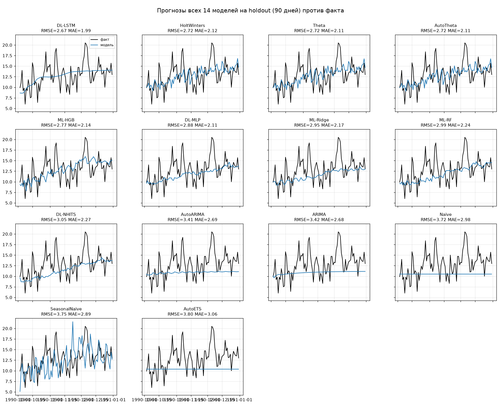

Лучшие представители семейств на одном графике:

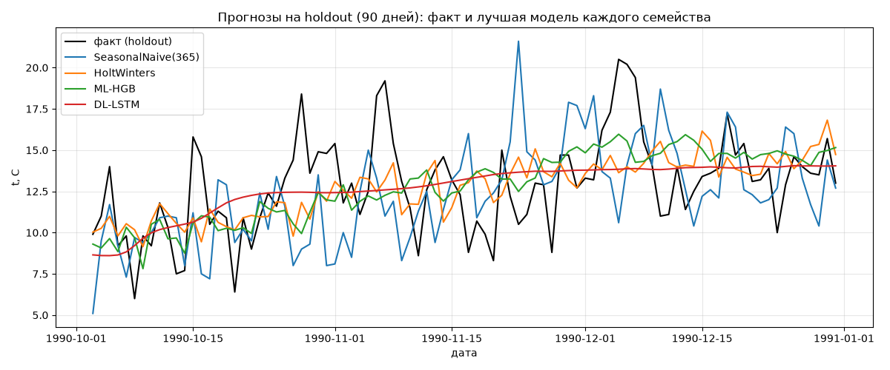

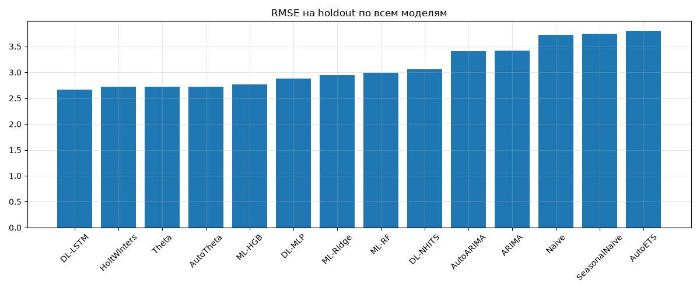

## 6. Анализ надежности

### 6.1 Бектест по окнам

Rolling-бектест, 3 окна по 90 дней (cutoff 05.04.1990, 04.07.1990, 02.10.1990), средний RMSE в `results/metrics_backtest.csv`, RMSE по каждому окну в `results/backtest_windows.csv`.

| Модель | Окно 1 | Окно 2 | Окно 3 | Среднее |
|---|---|---|---|---|
| ML-HGB | 2.406 | 2.571 | 2.770 | 2.582 |
| DL-MLP | 2.433 | 2.568 | 2.797 | 2.599 |
| ML-RF | 2.457 | 2.538 | 2.986 | 2.660 |
| HoltWinters | 2.420 | 2.851 | 2.721 | 2.664 |
| ML-Ridge | 2.694 | 2.480 | 2.948 | 2.708 |
| Theta / AutoTheta | 2.518 | 2.937 | 2.722 | 2.726 |
| DL-NHITS | 2.852 | 2.711 | 3.084 | 2.882 |
| DL-LSTM | 3.475 | 4.024 | 2.568 | 3.355 |
| ARIMA | 3.557 | 3.114 | 3.417 | 3.363 |
| AutoARIMA | 3.590 | 3.270 | 3.408 | 3.423 |
| SeasonalNaive | 3.381 | 3.655 | 3.750 | 3.595 |
| AutoETS | 4.757 | 2.638 | 3.799 | 3.731 |
| Naive | 5.420 | 2.600 | 3.724 | 3.915 |

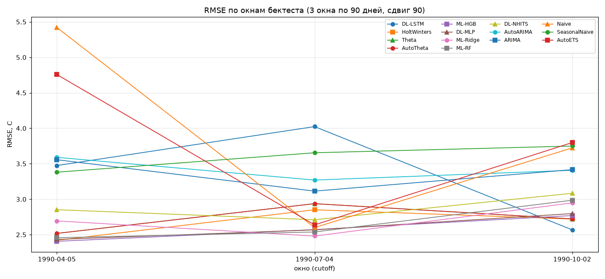

Ключевое наблюдение исследования: DL-LSTM, лучший на единственном holdout (2.669), в бектесте проваливается до девятого места (среднее 3.355, худшие окна 3.475 и 4.024). Сеть выигрывает одно конкретное окно за счет гибкости, а не устойчивости. Лидеры бектеста: ML-HGB (2.582, первое место при втором месте на holdout) и DL-MLP (2.599). Порядок семейств (ML и сезонные статметоды впереди, ARIMA и наивы позади) подтверждается обоими замерами.

### 6.2 Значимость различий: тест Диболда-Мариано

Проверка на holdout, HAC-оценка дисперсии с лагом 3, `results/dm_test.csv`, уровень значимости 0.05.

- Отличие DL-LSTM от HoltWinters, Theta и ML-HGB статистически не значимо: p-value 0.67, 0.67, 0.61. Формальная победа LSTM на holdout не означает реального превосходства над топ-группой.
- Отличие DL-LSTM от ARIMA (p=0.032), AutoARIMA (p=0.037), Naive (p=0.011), SeasonalNaive (p=0.0008) и AutoETS (p=0.008) значимо.

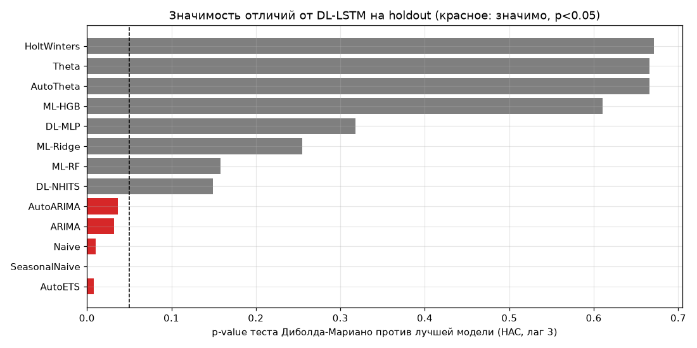

Отсюда выбор модели для пайплайна падает на HoltWinters и ML-HGB, а не на LSTM: у HoltWinters результат статистически неотличим от лучшего при детерминированном обучении за секунды, у ML-HGB первое место в бектесте.

### 6.3 Вероятностные оценки

Интервалы HoltWinters на holdout (`results/coverage.csv`, `img/07_intervals.png`): покрытие 80% интервала 0.811 при номинале 0.80, покрытие 95% интервала 0.933 при номинале 0.95. Калибровка в пределах 0.02, интервалам можно доверять.

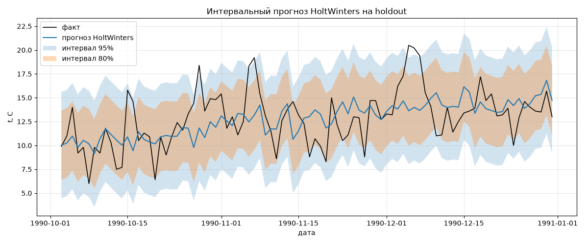

### 6.4 Остатки

Остатки DL-LSTM на holdout (`results/residuals.csv`, `img/08_residuals_acf.png`): среднее 0.067 C (смещения нет), std 2.720, Ljung-Box(10) p-value 0.00041, в остатках осталась автокорреляция. Это зафиксированный предел точности на данном ряде: RMSE 2.669 против std ряда 4.07, часть структуры не вычерпывается ни одним из 14 методов.

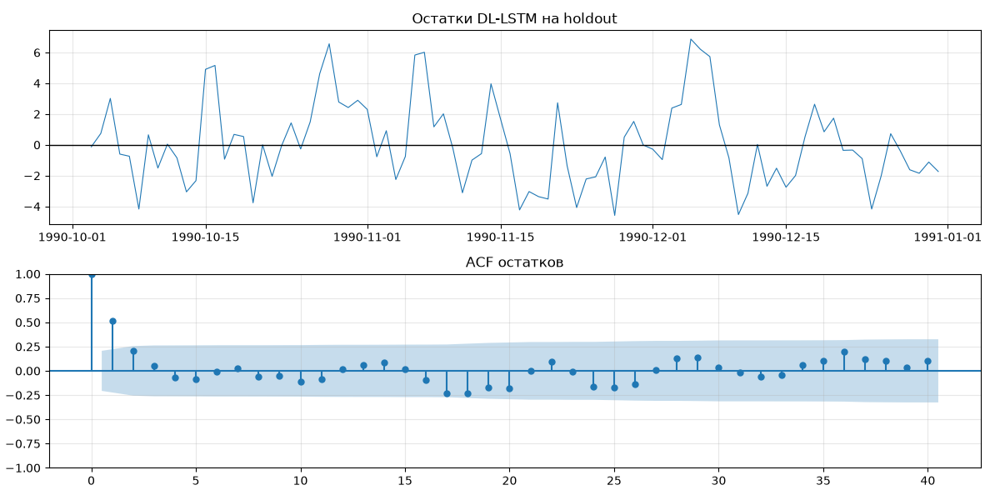

## 7. Пайплайн и тестирование

`pipeline.py`: загрузка `data/melbourne_tmin_daily_processed.csv`, сортировка, достройка дневной сетки, интерполяция, обучение HoltWinters(365) и SeasonalNaive(365), прогноз 90 дней, метрики и замер времени.

Прогон `python pipeline.py`: HoltWinters RMSE=2.721 MAE=2.115 MAPE=17.17%, SeasonalNaive RMSE=3.750 MAE=2.891 MAPE=23.07%, время 2.5 c. Числа совпадают с ноутбуком до тысячных.

Выбор HoltWinters для пайплайна обоснован разделом 6: результат на holdout статистически неотличим от лучшего (DM p=0.67), в бектесте лучший среди статметодов (2.664), обучение детерминированное и занимает секунды, интервалы откалиброваны (0.811 и 0.933).

Время счета (замерено кодом): статметоды 100 c, ML 5 c, DL 76 c на holdout, бектест 283 c / 11 c / 77 c соответственно.

## 8. Верифицируемость

- Все параметры всех моделей, seed и версии библиотек собраны в `results/model_configs.json`.
- Порядок воспроизведения: `uv venv --python 3.12 && uv pip install -r requirements.txt`, затем `AVR2_Time_Series_Analysis.ipynb` (полный анализ), `report_figures.py` (пересборка моделей и графиков отчета, контроль воспроизводимости), `pipeline.py` (продакшн-прогон).
- Контроль детерминизма выполнен: повторный прогон статметодов в `report_figures.py` воспроизводит метрики `results/metrics_holdout.csv` с точностью до 1e-9 (Naive 3.7236, HoltWinters 2.7206, Theta 2.7221 и т.д.). ML использует random_state=42, DL random_seed=42.
- Все числа отчета взяты из файлов `results/*.csv`, являющихся выводом кода. Ни одного числа, которого нет в результатах прогона, в отчете нет.

## 9. Выводы по задачам

**Задача 1 (данные и EDA).** Ряд подготовлен: 3652 дня 1981-1990, 2 пропущенные даты интерполированы, среднее 11.18 C, std 4.07. ADF p=0.00025, ряд стационарен в уровнях. Годовая сезонность подтверждена ACF(365)=0.48, месячными средними (январь 15.0 C, июль 6.7 C) и декомпозицией (0.81 дисперсии в сезонной компоненте). Подготовленный ряд сохранен в `data/melbourne_tmin_daily_processed.csv`.

**Задача 2 (статметоды).** Лучшие: HoltWinters 2.721 и Theta 2.722, оба лучше бейзлайнов (3.724, 3.750) более чем на градус. Ручные режимы не уступают авто: ARIMA ручной 3.417 против авто 3.408, Theta совпадает с AutoTheta до тысячных. AutoETS 3.799 хуже наивного: автовыбор структуры на сезонности 365 дней ненадежен, это зафиксировано как результат эксперимента.

**Задача 3 (ML и DL).** Лучший ML: HGB, 2.770 на holdout и 2.582 в бектесте (первое место). Лучший DL на holdout: LSTM 2.669, но в бектесте 3.355 (девятое место): победа на одном окне не устойчива. Тест Диболда-Мариано показал, что различие LSTM с HoltWinters, Theta и HGB не значимо (p > 0.6), а с наивами и ARIMA значимо (p < 0.04). Практический итог: на этом ряде ML-бустинг и сезонные статметоды надежнее DL.

**Задача 4 (пайплайн и отчет).** Пайплайн на HoltWinters воспроизводит числа ноутбука (2.721 / 2.115 / 17.17%) за 2.5 c. Отчет содержит все разделы чек-листа, каждый вывод подкреплен числом из `results/*.csv`, медиаматериалы встроены в текст разделами 3, 5, 6.

## 10. Общее заключение

Данные: суточный минимум температуры воздуха в Мельбурне, 1981-1990, 3652 дня, источник BOM Australia через открытый набор Brownlee. Цель: прогноз на 90 дней и обоснованный выбор метода среди 14 конфигураций (2 бейзлайна, 6 статистических в ручном и авто режимах, 3 ML, 3 DL).

Численные итоги: лучший результат на holdout у DL-LSTM, RMSE 2.669 C (MAE 1.986, MAPE 16.49%). Самый устойчивый по rolling-бектесту из 3 окон: ML-HGB, средний RMSE 2.582. Лучший статистический: HoltWinters, 2.721 на holdout и 2.664 в бектесте. Бейзлайны: 3.724 и 3.750. Тест Диболда-Мариано: различие между LSTM и топ-группой (HoltWinters, Theta, HGB) статистически не значимо (p > 0.6), то есть уверенным преимуществом является только отрыв от наивных методов и ARIMA (p < 0.04). Интервалы HoltWinters откалиброваны: покрытие 0.811 и 0.933 при номиналах 0.80 и 0.95. В остатках лучшей модели сохраняется автокорреляция (Ljung-Box p=0.00041), RMSE 2.669 против std ряда 4.07 фиксирует предел точности на этом ряде.

Практический вывод: в эксплуатацию идут HoltWinters (детерминирован, обучается за секунды, интервалы откалиброваны, результат неотличим от лучшего статистически) или ML-HGB (первое место в бектесте). LSTM после бектеста и DM-теста отложен как нестабильный. Пайплайн `pipeline.py` воспроизводит результат за 2.5 c, полные конфигурации и версии открыты в `results/model_configs.json`.
